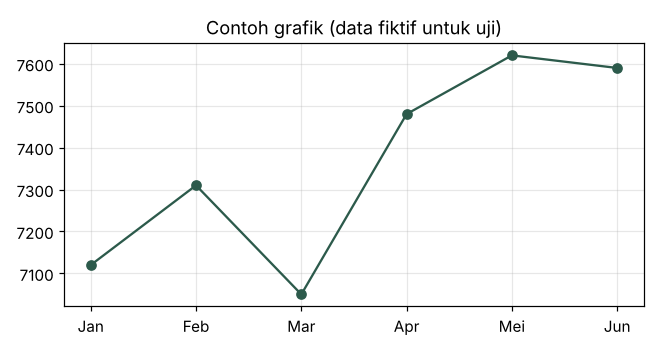

# Modul Uji Pustakaku

*Dokumen ini dibuat otomatis untuk menguji aplikasi. Isinya contoh umum, bukan data pasar.*

## Bab 1: Mengenal Pasar Saham

Laporan laba rugi menunjukkan pendapatan, beban, dan laba dalam satu periode. Neraca memotret aset, liabilitas, dan ekuitas pada satu titik waktu. Laporan arus kas menjelaskan dari mana uang masuk dan ke mana uang keluar.

Rasio seperti PER dan PBV berguna sebagai titik awal perbandingan, tetapi tidak cukup untuk menyimpulkan murah atau mahal. Rasio harus dibaca bersama kualitas laba, utang, prospek industri, dan siklus bisnis.

Analisis fundamental berusaha menilai kesehatan bisnis melalui laporan keuangan, model bisnis, posisi persaingan, dan kualitas manajemen. Hasilnya dipakai untuk memperkirakan nilai wajar, bukan untuk menebak harga besok pagi.

### 1.1 Konsep inti

Analisis fundamental berusaha menilai kesehatan bisnis melalui laporan keuangan, model bisnis, posisi persaingan, dan kualitas manajemen. Hasilnya dipakai untuk memperkirakan nilai wajar, bukan untuk menebak harga besok pagi. Saham adalah bukti kepemilikan sebagian atas sebuah perusahaan. Ketika seseorang membeli saham, ia ikut memiliki hak atas laba dan aset perusahaan sesuai porsi kepemilikannya, sekaligus menanggung risiko jika kinerja perusahaan memburuk.

Manajemen risiko berarti menentukan berapa besar kerugian yang sanggup ditanggung sebelum membuka posisi. Diversifikasi, ukuran posisi yang wajar, dan dana darurat adalah fondasi yang sering diabaikan pemula. Rasio seperti PER dan PBV berguna sebagai titik awal perbandingan, tetapi tidak cukup untuk menyimpulkan murah atau mahal. Rasio harus dibaca bersama kualitas laba, utang, prospek industri, dan siklus bisnis.[^n1]

Poin penting yang perlu diingat:

- Pahami bisnis sebelum melihat harga.
- Gunakan sumber resmi untuk data perusahaan.
    - Laporan tahunan dan laporan keuangan.
    - Keterbukaan informasi di situs bursa.
- Catat asumsi yang dipakai.

### 1.2 Langkah praktis

1. Tentukan tujuan dan jangka waktu.
2. Kumpulkan data dari laporan resmi.
3. Hitung rasio utama dan bandingkan dengan pesaing.
4. Tulis kesimpulan beserta risikonya.

Rasio seperti PER dan PBV berguna sebagai titik awal perbandingan, tetapi tidak cukup untuk menyimpulkan murah atau mahal. Rasio harus dibaca bersama kualitas laba, utang, prospek industri, dan siklus bisnis. Analisis fundamental berusaha menilai kesehatan bisnis melalui laporan keuangan, model bisnis, posisi persaingan, dan kualitas manajemen. Hasilnya dipakai untuk memperkirakan nilai wajar, bukan untuk menebak harga besok pagi.

Rasio seperti PER dan PBV berguna sebagai titik awal perbandingan, tetapi tidak cukup untuk menyimpulkan murah atau mahal. Rasio harus dibaca bersama kualitas laba, utang, prospek industri, dan siklus bisnis. Analisis fundamental berusaha menilai kesehatan bisnis melalui laporan keuangan, model bisnis, posisi persaingan, dan kualitas manajemen. Hasilnya dipakai untuk memperkirakan nilai wajar, bukan untuk menebak harga besok pagi.

| Rasio | Rumus | Kegunaan |
|---|---|---|
| PER | Harga / Laba per saham | Membandingkan harga dengan laba |
| PBV | Harga / Nilai buku per saham | Membandingkan harga dengan ekuitas |
| ROE | Laba bersih / Ekuitas | Mengukur efisiensi modal |
| DER | Total utang / Ekuitas | Mengukur ketergantungan pada utang |

> Catatan: angka dalam contoh ini fiktif dan hanya untuk latihan.

Manajemen risiko berarti menentukan berapa besar kerugian yang sanggup ditanggung sebelum membuka posisi. Diversifikasi, ukuran posisi yang wajar, dan dana darurat adalah fondasi yang sering diabaikan pemula.

Saham adalah bukti kepemilikan sebagian atas sebuah perusahaan. Ketika seseorang membeli saham, ia ikut memiliki hak atas laba dan aset perusahaan sesuai porsi kepemilikannya, sekaligus menanggung risiko jika kinerja perusahaan memburuk.

Rasio seperti PER dan PBV berguna sebagai titik awal perbandingan, tetapi tidak cukup untuk menyimpulkan murah atau mahal. Rasio harus dibaca bersama kualitas laba, utang, prospek industri, dan siklus bisnis. Manajemen risiko berarti menentukan berapa besar kerugian yang sanggup ditanggung sebelum membuka posisi. Diversifikasi, ukuran posisi yang wajar, dan dana darurat adalah fondasi yang sering diabaikan pemula.

Saham adalah bukti kepemilikan sebagian atas sebuah perusahaan. Ketika seseorang membeli saham, ia ikut memiliki hak atas laba dan aset perusahaan sesuai porsi kepemilikannya, sekaligus menanggung risiko jika kinerja perusahaan memburuk.

Baca juga [halaman resmi bursa](https://www.idx.co.id) untuk istilah resmi.

Analisis teknikal mempelajari pergerakan harga dan volume di masa lalu untuk mengenali pola. Pendekatan ini tidak menjamin hasil; ia membantu menyusun rencana masuk, keluar, dan batas kerugian secara disiplin. Analisis teknikal mempelajari pergerakan harga dan volume di masa lalu untuk mengenali pola. Pendekatan ini tidak menjamin hasil; ia membantu menyusun rencana masuk, keluar, dan batas kerugian secara disiplin.

Analisis fundamental berusaha menilai kesehatan bisnis melalui laporan keuangan, model bisnis, posisi persaingan, dan kualitas manajemen. Hasilnya dipakai untuk memperkirakan nilai wajar, bukan untuk menebak harga besok pagi.

Analisis teknikal mempelajari pergerakan harga dan volume di masa lalu untuk mengenali pola. Pendekatan ini tidak menjamin hasil; ia membantu menyusun rencana masuk, keluar, dan batas kerugian secara disiplin. Manajemen risiko berarti menentukan berapa besar kerugian yang sanggup ditanggung sebelum membuka posisi. Diversifikasi, ukuran posisi yang wajar, dan dana darurat adalah fondasi yang sering diabaikan pemula.

Laporan laba rugi menunjukkan pendapatan, beban, dan laba dalam satu periode. Neraca memotret aset, liabilitas, dan ekuitas pada satu titik waktu. Laporan arus kas menjelaskan dari mana uang masuk dan ke mana uang keluar. Analisis fundamental berusaha menilai kesehatan bisnis melalui laporan keuangan, model bisnis, posisi persaingan, dan kualitas manajemen. Hasilnya dipakai untuk memperkirakan nilai wajar, bukan untuk menebak harga besok pagi.

Saham adalah bukti kepemilikan sebagian atas sebuah perusahaan. Ketika seseorang membeli saham, ia ikut memiliki hak atas laba dan aset perusahaan sesuai porsi kepemilikannya, sekaligus menanggung risiko jika kinerja perusahaan memburuk.

## Bab 2: Membaca Laporan Keuangan

Disiplin mencatat setiap keputusan investasi membantu belajar dari kesalahan. Tulis alasan membeli, skenario yang diharapkan, dan kondisi yang membuat alasan itu tidak berlaku lagi.

Rasio seperti PER dan PBV berguna sebagai titik awal perbandingan, tetapi tidak cukup untuk menyimpulkan murah atau mahal. Rasio harus dibaca bersama kualitas laba, utang, prospek industri, dan siklus bisnis.

Disiplin mencatat setiap keputusan investasi membantu belajar dari kesalahan. Tulis alasan membeli, skenario yang diharapkan, dan kondisi yang membuat alasan itu tidak berlaku lagi.

### 2.1 Konsep inti

Disiplin mencatat setiap keputusan investasi membantu belajar dari kesalahan. Tulis alasan membeli, skenario yang diharapkan, dan kondisi yang membuat alasan itu tidak berlaku lagi. Manajemen risiko berarti menentukan berapa besar kerugian yang sanggup ditanggung sebelum membuka posisi. Diversifikasi, ukuran posisi yang wajar, dan dana darurat adalah fondasi yang sering diabaikan pemula.

Analisis teknikal mempelajari pergerakan harga dan volume di masa lalu untuk mengenali pola. Pendekatan ini tidak menjamin hasil; ia membantu menyusun rencana masuk, keluar, dan batas kerugian secara disiplin.[^n2]

Poin penting yang perlu diingat:

- Pahami bisnis sebelum melihat harga.
- Gunakan sumber resmi untuk data perusahaan.
    - Laporan tahunan dan laporan keuangan.
    - Keterbukaan informasi di situs bursa.
- Catat asumsi yang dipakai.

### 2.2 Langkah praktis

1. Tentukan tujuan dan jangka waktu.
2. Kumpulkan data dari laporan resmi.
3. Hitung rasio utama dan bandingkan dengan pesaing.
4. Tulis kesimpulan beserta risikonya.

Manajemen risiko berarti menentukan berapa besar kerugian yang sanggup ditanggung sebelum membuka posisi. Diversifikasi, ukuran posisi yang wajar, dan dana darurat adalah fondasi yang sering diabaikan pemula. Valuasi selalu bergantung pada asumsi. Dua analis yang membaca laporan keuangan yang sama bisa menghasilkan angka nilai wajar yang berbeda karena memakai asumsi pertumbuhan dan tingkat diskonto yang berbeda pula.

Disiplin mencatat setiap keputusan investasi membantu belajar dari kesalahan. Tulis alasan membeli, skenario yang diharapkan, dan kondisi yang membuat alasan itu tidak berlaku lagi.

| Rasio | Rumus | Kegunaan |
|---|---|---|
| PER | Harga / Laba per saham | Membandingkan harga dengan laba |
| PBV | Harga / Nilai buku per saham | Membandingkan harga dengan ekuitas |
| ROE | Laba bersih / Ekuitas | Mengukur efisiensi modal |
| DER | Total utang / Ekuitas | Mengukur ketergantungan pada utang |



> Catatan: angka dalam contoh ini fiktif dan hanya untuk latihan.

Disiplin mencatat setiap keputusan investasi membantu belajar dari kesalahan. Tulis alasan membeli, skenario yang diharapkan, dan kondisi yang membuat alasan itu tidak berlaku lagi. Analisis fundamental berusaha menilai kesehatan bisnis melalui laporan keuangan, model bisnis, posisi persaingan, dan kualitas manajemen. Hasilnya dipakai untuk memperkirakan nilai wajar, bukan untuk menebak harga besok pagi.

Analisis fundamental berusaha menilai kesehatan bisnis melalui laporan keuangan, model bisnis, posisi persaingan, dan kualitas manajemen. Hasilnya dipakai untuk memperkirakan nilai wajar, bukan untuk menebak harga besok pagi.

Analisis teknikal mempelajari pergerakan harga dan volume di masa lalu untuk mengenali pola. Pendekatan ini tidak menjamin hasil; ia membantu menyusun rencana masuk, keluar, dan batas kerugian secara disiplin.

Analisis teknikal mempelajari pergerakan harga dan volume di masa lalu untuk mengenali pola. Pendekatan ini tidak menjamin hasil; ia membantu menyusun rencana masuk, keluar, dan batas kerugian secara disiplin.

Baca juga [halaman resmi bursa](https://www.idx.co.id) untuk istilah resmi.

Rasio seperti PER dan PBV berguna sebagai titik awal perbandingan, tetapi tidak cukup untuk menyimpulkan murah atau mahal. Rasio harus dibaca bersama kualitas laba, utang, prospek industri, dan siklus bisnis. Analisis fundamental berusaha menilai kesehatan bisnis melalui laporan keuangan, model bisnis, posisi persaingan, dan kualitas manajemen. Hasilnya dipakai untuk memperkirakan nilai wajar, bukan untuk menebak harga besok pagi.

Laporan laba rugi menunjukkan pendapatan, beban, dan laba dalam satu periode. Neraca memotret aset, liabilitas, dan ekuitas pada satu titik waktu. Laporan arus kas menjelaskan dari mana uang masuk dan ke mana uang keluar. Laporan laba rugi menunjukkan pendapatan, beban, dan laba dalam satu periode. Neraca memotret aset, liabilitas, dan ekuitas pada satu titik waktu. Laporan arus kas menjelaskan dari mana uang masuk dan ke mana uang keluar.

Disiplin mencatat setiap keputusan investasi membantu belajar dari kesalahan. Tulis alasan membeli, skenario yang diharapkan, dan kondisi yang membuat alasan itu tidak berlaku lagi.

Disiplin mencatat setiap keputusan investasi membantu belajar dari kesalahan. Tulis alasan membeli, skenario yang diharapkan, dan kondisi yang membuat alasan itu tidak berlaku lagi. Analisis fundamental berusaha menilai kesehatan bisnis melalui laporan keuangan, model bisnis, posisi persaingan, dan kualitas manajemen. Hasilnya dipakai untuk memperkirakan nilai wajar, bukan untuk menebak harga besok pagi.

Valuasi selalu bergantung pada asumsi. Dua analis yang membaca laporan keuangan yang sama bisa menghasilkan angka nilai wajar yang berbeda karena memakai asumsi pertumbuhan dan tingkat diskonto yang berbeda pula. Analisis fundamental berusaha menilai kesehatan bisnis melalui laporan keuangan, model bisnis, posisi persaingan, dan kualitas manajemen. Hasilnya dipakai untuk memperkirakan nilai wajar, bukan untuk menebak harga besok pagi.

## Bab 3: Valuasi Dasar

Saham adalah bukti kepemilikan sebagian atas sebuah perusahaan. Ketika seseorang membeli saham, ia ikut memiliki hak atas laba dan aset perusahaan sesuai porsi kepemilikannya, sekaligus menanggung risiko jika kinerja perusahaan memburuk.

Valuasi selalu bergantung pada asumsi. Dua analis yang membaca laporan keuangan yang sama bisa menghasilkan angka nilai wajar yang berbeda karena memakai asumsi pertumbuhan dan tingkat diskonto yang berbeda pula.

Disiplin mencatat setiap keputusan investasi membantu belajar dari kesalahan. Tulis alasan membeli, skenario yang diharapkan, dan kondisi yang membuat alasan itu tidak berlaku lagi. Rasio seperti PER dan PBV berguna sebagai titik awal perbandingan, tetapi tidak cukup untuk menyimpulkan murah atau mahal. Rasio harus dibaca bersama kualitas laba, utang, prospek industri, dan siklus bisnis.

### 3.1 Konsep inti

Laporan laba rugi menunjukkan pendapatan, beban, dan laba dalam satu periode. Neraca memotret aset, liabilitas, dan ekuitas pada satu titik waktu. Laporan arus kas menjelaskan dari mana uang masuk dan ke mana uang keluar. Disiplin mencatat setiap keputusan investasi membantu belajar dari kesalahan. Tulis alasan membeli, skenario yang diharapkan, dan kondisi yang membuat alasan itu tidak berlaku lagi.

Laporan laba rugi menunjukkan pendapatan, beban, dan laba dalam satu periode. Neraca memotret aset, liabilitas, dan ekuitas pada satu titik waktu. Laporan arus kas menjelaskan dari mana uang masuk dan ke mana uang keluar. Analisis fundamental berusaha menilai kesehatan bisnis melalui laporan keuangan, model bisnis, posisi persaingan, dan kualitas manajemen. Hasilnya dipakai untuk memperkirakan nilai wajar, bukan untuk menebak harga besok pagi.[^n3]

Poin penting yang perlu diingat:

- Pahami bisnis sebelum melihat harga.
- Gunakan sumber resmi untuk data perusahaan.
    - Laporan tahunan dan laporan keuangan.
    - Keterbukaan informasi di situs bursa.
- Catat asumsi yang dipakai.

### 3.2 Langkah praktis

1. Tentukan tujuan dan jangka waktu.
2. Kumpulkan data dari laporan resmi.
3. Hitung rasio utama dan bandingkan dengan pesaing.
4. Tulis kesimpulan beserta risikonya.

Disiplin mencatat setiap keputusan investasi membantu belajar dari kesalahan. Tulis alasan membeli, skenario yang diharapkan, dan kondisi yang membuat alasan itu tidak berlaku lagi. Valuasi selalu bergantung pada asumsi. Dua analis yang membaca laporan keuangan yang sama bisa menghasilkan angka nilai wajar yang berbeda karena memakai asumsi pertumbuhan dan tingkat diskonto yang berbeda pula.

Analisis teknikal mempelajari pergerakan harga dan volume di masa lalu untuk mengenali pola. Pendekatan ini tidak menjamin hasil; ia membantu menyusun rencana masuk, keluar, dan batas kerugian secara disiplin.

| Rasio | Rumus | Kegunaan |
|---|---|---|
| PER | Harga / Laba per saham | Membandingkan harga dengan laba |
| PBV | Harga / Nilai buku per saham | Membandingkan harga dengan ekuitas |
| ROE | Laba bersih / Ekuitas | Mengukur efisiensi modal |
| DER | Total utang / Ekuitas | Mengukur ketergantungan pada utang |

> Catatan: angka dalam contoh ini fiktif dan hanya untuk latihan.

Rasio seperti PER dan PBV berguna sebagai titik awal perbandingan, tetapi tidak cukup untuk menyimpulkan murah atau mahal. Rasio harus dibaca bersama kualitas laba, utang, prospek industri, dan siklus bisnis. Disiplin mencatat setiap keputusan investasi membantu belajar dari kesalahan. Tulis alasan membeli, skenario yang diharapkan, dan kondisi yang membuat alasan itu tidak berlaku lagi.

Analisis fundamental berusaha menilai kesehatan bisnis melalui laporan keuangan, model bisnis, posisi persaingan, dan kualitas manajemen. Hasilnya dipakai untuk memperkirakan nilai wajar, bukan untuk menebak harga besok pagi. Rasio seperti PER dan PBV berguna sebagai titik awal perbandingan, tetapi tidak cukup untuk menyimpulkan murah atau mahal. Rasio harus dibaca bersama kualitas laba, utang, prospek industri, dan siklus bisnis.

Valuasi selalu bergantung pada asumsi. Dua analis yang membaca laporan keuangan yang sama bisa menghasilkan angka nilai wajar yang berbeda karena memakai asumsi pertumbuhan dan tingkat diskonto yang berbeda pula.

Rasio seperti PER dan PBV berguna sebagai titik awal perbandingan, tetapi tidak cukup untuk menyimpulkan murah atau mahal. Rasio harus dibaca bersama kualitas laba, utang, prospek industri, dan siklus bisnis.

```
Nilai wajar = Laba per saham x PER wajar
Margin keamanan = (Nilai wajar - Harga) / Nilai wajar
```

Baca juga [halaman resmi bursa](https://www.idx.co.id) untuk istilah resmi.

Valuasi selalu bergantung pada asumsi. Dua analis yang membaca laporan keuangan yang sama bisa menghasilkan angka nilai wajar yang berbeda karena memakai asumsi pertumbuhan dan tingkat diskonto yang berbeda pula.

Laporan laba rugi menunjukkan pendapatan, beban, dan laba dalam satu periode. Neraca memotret aset, liabilitas, dan ekuitas pada satu titik waktu. Laporan arus kas menjelaskan dari mana uang masuk dan ke mana uang keluar.

Rasio seperti PER dan PBV berguna sebagai titik awal perbandingan, tetapi tidak cukup untuk menyimpulkan murah atau mahal. Rasio harus dibaca bersama kualitas laba, utang, prospek industri, dan siklus bisnis.

Analisis teknikal mempelajari pergerakan harga dan volume di masa lalu untuk mengenali pola. Pendekatan ini tidak menjamin hasil; ia membantu menyusun rencana masuk, keluar, dan batas kerugian secara disiplin. Analisis teknikal mempelajari pergerakan harga dan volume di masa lalu untuk mengenali pola. Pendekatan ini tidak menjamin hasil; ia membantu menyusun rencana masuk, keluar, dan batas kerugian secara disiplin.

Manajemen risiko berarti menentukan berapa besar kerugian yang sanggup ditanggung sebelum membuka posisi. Diversifikasi, ukuran posisi yang wajar, dan dana darurat adalah fondasi yang sering diabaikan pemula.

## Bab 4: Analisis Teknikal

Saham adalah bukti kepemilikan sebagian atas sebuah perusahaan. Ketika seseorang membeli saham, ia ikut memiliki hak atas laba dan aset perusahaan sesuai porsi kepemilikannya, sekaligus menanggung risiko jika kinerja perusahaan memburuk. Analisis teknikal mempelajari pergerakan harga dan volume di masa lalu untuk mengenali pola. Pendekatan ini tidak menjamin hasil; ia membantu menyusun rencana masuk, keluar, dan batas kerugian secara disiplin.

Valuasi selalu bergantung pada asumsi. Dua analis yang membaca laporan keuangan yang sama bisa menghasilkan angka nilai wajar yang berbeda karena memakai asumsi pertumbuhan dan tingkat diskonto yang berbeda pula. Analisis teknikal mempelajari pergerakan harga dan volume di masa lalu untuk mengenali pola. Pendekatan ini tidak menjamin hasil; ia membantu menyusun rencana masuk, keluar, dan batas kerugian secara disiplin.

Rasio seperti PER dan PBV berguna sebagai titik awal perbandingan, tetapi tidak cukup untuk menyimpulkan murah atau mahal. Rasio harus dibaca bersama kualitas laba, utang, prospek industri, dan siklus bisnis.

### 4.1 Konsep inti

Laporan laba rugi menunjukkan pendapatan, beban, dan laba dalam satu periode. Neraca memotret aset, liabilitas, dan ekuitas pada satu titik waktu. Laporan arus kas menjelaskan dari mana uang masuk dan ke mana uang keluar.

Saham adalah bukti kepemilikan sebagian atas sebuah perusahaan. Ketika seseorang membeli saham, ia ikut memiliki hak atas laba dan aset perusahaan sesuai porsi kepemilikannya, sekaligus menanggung risiko jika kinerja perusahaan memburuk. Rasio seperti PER dan PBV berguna sebagai titik awal perbandingan, tetapi tidak cukup untuk menyimpulkan murah atau mahal. Rasio harus dibaca bersama kualitas laba, utang, prospek industri, dan siklus bisnis.[^n4]

Poin penting yang perlu diingat:

- Pahami bisnis sebelum melihat harga.
- Gunakan sumber resmi untuk data perusahaan.
    - Laporan tahunan dan laporan keuangan.
    - Keterbukaan informasi di situs bursa.
- Catat asumsi yang dipakai.

### 4.2 Langkah praktis

1. Tentukan tujuan dan jangka waktu.
2. Kumpulkan data dari laporan resmi.
3. Hitung rasio utama dan bandingkan dengan pesaing.
4. Tulis kesimpulan beserta risikonya.

Rasio seperti PER dan PBV berguna sebagai titik awal perbandingan, tetapi tidak cukup untuk menyimpulkan murah atau mahal. Rasio harus dibaca bersama kualitas laba, utang, prospek industri, dan siklus bisnis. Analisis fundamental berusaha menilai kesehatan bisnis melalui laporan keuangan, model bisnis, posisi persaingan, dan kualitas manajemen. Hasilnya dipakai untuk memperkirakan nilai wajar, bukan untuk menebak harga besok pagi.

Disiplin mencatat setiap keputusan investasi membantu belajar dari kesalahan. Tulis alasan membeli, skenario yang diharapkan, dan kondisi yang membuat alasan itu tidak berlaku lagi.

| Rasio | Rumus | Kegunaan |
|---|---|---|
| PER | Harga / Laba per saham | Membandingkan harga dengan laba |
| PBV | Harga / Nilai buku per saham | Membandingkan harga dengan ekuitas |
| ROE | Laba bersih / Ekuitas | Mengukur efisiensi modal |
| DER | Total utang / Ekuitas | Mengukur ketergantungan pada utang |

> Catatan: angka dalam contoh ini fiktif dan hanya untuk latihan.

Saham adalah bukti kepemilikan sebagian atas sebuah perusahaan. Ketika seseorang membeli saham, ia ikut memiliki hak atas laba dan aset perusahaan sesuai porsi kepemilikannya, sekaligus menanggung risiko jika kinerja perusahaan memburuk. Manajemen risiko berarti menentukan berapa besar kerugian yang sanggup ditanggung sebelum membuka posisi. Diversifikasi, ukuran posisi yang wajar, dan dana darurat adalah fondasi yang sering diabaikan pemula.

Disiplin mencatat setiap keputusan investasi membantu belajar dari kesalahan. Tulis alasan membeli, skenario yang diharapkan, dan kondisi yang membuat alasan itu tidak berlaku lagi. Laporan laba rugi menunjukkan pendapatan, beban, dan laba dalam satu periode. Neraca memotret aset, liabilitas, dan ekuitas pada satu titik waktu. Laporan arus kas menjelaskan dari mana uang masuk dan ke mana uang keluar.

Saham adalah bukti kepemilikan sebagian atas sebuah perusahaan. Ketika seseorang membeli saham, ia ikut memiliki hak atas laba dan aset perusahaan sesuai porsi kepemilikannya, sekaligus menanggung risiko jika kinerja perusahaan memburuk. Analisis teknikal mempelajari pergerakan harga dan volume di masa lalu untuk mengenali pola. Pendekatan ini tidak menjamin hasil; ia membantu menyusun rencana masuk, keluar, dan batas kerugian secara disiplin.

Analisis fundamental berusaha menilai kesehatan bisnis melalui laporan keuangan, model bisnis, posisi persaingan, dan kualitas manajemen. Hasilnya dipakai untuk memperkirakan nilai wajar, bukan untuk menebak harga besok pagi.

Baca juga [halaman resmi bursa](https://www.idx.co.id) untuk istilah resmi.

Saham adalah bukti kepemilikan sebagian atas sebuah perusahaan. Ketika seseorang membeli saham, ia ikut memiliki hak atas laba dan aset perusahaan sesuai porsi kepemilikannya, sekaligus menanggung risiko jika kinerja perusahaan memburuk. Manajemen risiko berarti menentukan berapa besar kerugian yang sanggup ditanggung sebelum membuka posisi. Diversifikasi, ukuran posisi yang wajar, dan dana darurat adalah fondasi yang sering diabaikan pemula.

Rasio seperti PER dan PBV berguna sebagai titik awal perbandingan, tetapi tidak cukup untuk menyimpulkan murah atau mahal. Rasio harus dibaca bersama kualitas laba, utang, prospek industri, dan siklus bisnis. Valuasi selalu bergantung pada asumsi. Dua analis yang membaca laporan keuangan yang sama bisa menghasilkan angka nilai wajar yang berbeda karena memakai asumsi pertumbuhan dan tingkat diskonto yang berbeda pula.

Laporan laba rugi menunjukkan pendapatan, beban, dan laba dalam satu periode. Neraca memotret aset, liabilitas, dan ekuitas pada satu titik waktu. Laporan arus kas menjelaskan dari mana uang masuk dan ke mana uang keluar.

Disiplin mencatat setiap keputusan investasi membantu belajar dari kesalahan. Tulis alasan membeli, skenario yang diharapkan, dan kondisi yang membuat alasan itu tidak berlaku lagi. Disiplin mencatat setiap keputusan investasi membantu belajar dari kesalahan. Tulis alasan membeli, skenario yang diharapkan, dan kondisi yang membuat alasan itu tidak berlaku lagi.

Disiplin mencatat setiap keputusan investasi membantu belajar dari kesalahan. Tulis alasan membeli, skenario yang diharapkan, dan kondisi yang membuat alasan itu tidak berlaku lagi. Valuasi selalu bergantung pada asumsi. Dua analis yang membaca laporan keuangan yang sama bisa menghasilkan angka nilai wajar yang berbeda karena memakai asumsi pertumbuhan dan tingkat diskonto yang berbeda pula.

## Bab 5: Manajemen Risiko

Analisis fundamental berusaha menilai kesehatan bisnis melalui laporan keuangan, model bisnis, posisi persaingan, dan kualitas manajemen. Hasilnya dipakai untuk memperkirakan nilai wajar, bukan untuk menebak harga besok pagi. Laporan laba rugi menunjukkan pendapatan, beban, dan laba dalam satu periode. Neraca memotret aset, liabilitas, dan ekuitas pada satu titik waktu. Laporan arus kas menjelaskan dari mana uang masuk dan ke mana uang keluar.

Valuasi selalu bergantung pada asumsi. Dua analis yang membaca laporan keuangan yang sama bisa menghasilkan angka nilai wajar yang berbeda karena memakai asumsi pertumbuhan dan tingkat diskonto yang berbeda pula. Analisis teknikal mempelajari pergerakan harga dan volume di masa lalu untuk mengenali pola. Pendekatan ini tidak menjamin hasil; ia membantu menyusun rencana masuk, keluar, dan batas kerugian secara disiplin.

Saham adalah bukti kepemilikan sebagian atas sebuah perusahaan. Ketika seseorang membeli saham, ia ikut memiliki hak atas laba dan aset perusahaan sesuai porsi kepemilikannya, sekaligus menanggung risiko jika kinerja perusahaan memburuk. Laporan laba rugi menunjukkan pendapatan, beban, dan laba dalam satu periode. Neraca memotret aset, liabilitas, dan ekuitas pada satu titik waktu. Laporan arus kas menjelaskan dari mana uang masuk dan ke mana uang keluar.

### 5.1 Konsep inti

Analisis teknikal mempelajari pergerakan harga dan volume di masa lalu untuk mengenali pola. Pendekatan ini tidak menjamin hasil; ia membantu menyusun rencana masuk, keluar, dan batas kerugian secara disiplin.

Saham adalah bukti kepemilikan sebagian atas sebuah perusahaan. Ketika seseorang membeli saham, ia ikut memiliki hak atas laba dan aset perusahaan sesuai porsi kepemilikannya, sekaligus menanggung risiko jika kinerja perusahaan memburuk.[^n5]

Poin penting yang perlu diingat:

- Pahami bisnis sebelum melihat harga.
- Gunakan sumber resmi untuk data perusahaan.
    - Laporan tahunan dan laporan keuangan.
    - Keterbukaan informasi di situs bursa.
- Catat asumsi yang dipakai.

### 5.2 Langkah praktis

1. Tentukan tujuan dan jangka waktu.
2. Kumpulkan data dari laporan resmi.
3. Hitung rasio utama dan bandingkan dengan pesaing.
4. Tulis kesimpulan beserta risikonya.

Valuasi selalu bergantung pada asumsi. Dua analis yang membaca laporan keuangan yang sama bisa menghasilkan angka nilai wajar yang berbeda karena memakai asumsi pertumbuhan dan tingkat diskonto yang berbeda pula.

Analisis fundamental berusaha menilai kesehatan bisnis melalui laporan keuangan, model bisnis, posisi persaingan, dan kualitas manajemen. Hasilnya dipakai untuk memperkirakan nilai wajar, bukan untuk menebak harga besok pagi.

| Rasio | Rumus | Kegunaan |
|---|---|---|
| PER | Harga / Laba per saham | Membandingkan harga dengan laba |
| PBV | Harga / Nilai buku per saham | Membandingkan harga dengan ekuitas |
| ROE | Laba bersih / Ekuitas | Mengukur efisiensi modal |
| DER | Total utang / Ekuitas | Mengukur ketergantungan pada utang |

> Catatan: angka dalam contoh ini fiktif dan hanya untuk latihan.

Valuasi selalu bergantung pada asumsi. Dua analis yang membaca laporan keuangan yang sama bisa menghasilkan angka nilai wajar yang berbeda karena memakai asumsi pertumbuhan dan tingkat diskonto yang berbeda pula.

Analisis teknikal mempelajari pergerakan harga dan volume di masa lalu untuk mengenali pola. Pendekatan ini tidak menjamin hasil; ia membantu menyusun rencana masuk, keluar, dan batas kerugian secara disiplin. Manajemen risiko berarti menentukan berapa besar kerugian yang sanggup ditanggung sebelum membuka posisi. Diversifikasi, ukuran posisi yang wajar, dan dana darurat adalah fondasi yang sering diabaikan pemula.

Laporan laba rugi menunjukkan pendapatan, beban, dan laba dalam satu periode. Neraca memotret aset, liabilitas, dan ekuitas pada satu titik waktu. Laporan arus kas menjelaskan dari mana uang masuk dan ke mana uang keluar.

Manajemen risiko berarti menentukan berapa besar kerugian yang sanggup ditanggung sebelum membuka posisi. Diversifikasi, ukuran posisi yang wajar, dan dana darurat adalah fondasi yang sering diabaikan pemula.

Baca juga [halaman resmi bursa](https://www.idx.co.id) untuk istilah resmi.

Rasio seperti PER dan PBV berguna sebagai titik awal perbandingan, tetapi tidak cukup untuk menyimpulkan murah atau mahal. Rasio harus dibaca bersama kualitas laba, utang, prospek industri, dan siklus bisnis.

Manajemen risiko berarti menentukan berapa besar kerugian yang sanggup ditanggung sebelum membuka posisi. Diversifikasi, ukuran posisi yang wajar, dan dana darurat adalah fondasi yang sering diabaikan pemula. Disiplin mencatat setiap keputusan investasi membantu belajar dari kesalahan. Tulis alasan membeli, skenario yang diharapkan, dan kondisi yang membuat alasan itu tidak berlaku lagi.

Laporan laba rugi menunjukkan pendapatan, beban, dan laba dalam satu periode. Neraca memotret aset, liabilitas, dan ekuitas pada satu titik waktu. Laporan arus kas menjelaskan dari mana uang masuk dan ke mana uang keluar.

Saham adalah bukti kepemilikan sebagian atas sebuah perusahaan. Ketika seseorang membeli saham, ia ikut memiliki hak atas laba dan aset perusahaan sesuai porsi kepemilikannya, sekaligus menanggung risiko jika kinerja perusahaan memburuk.

Disiplin mencatat setiap keputusan investasi membantu belajar dari kesalahan. Tulis alasan membeli, skenario yang diharapkan, dan kondisi yang membuat alasan itu tidak berlaku lagi. Laporan laba rugi menunjukkan pendapatan, beban, dan laba dalam satu periode. Neraca memotret aset, liabilitas, dan ekuitas pada satu titik waktu. Laporan arus kas menjelaskan dari mana uang masuk dan ke mana uang keluar.

## Bab 6: Menyusun Rencana

Disiplin mencatat setiap keputusan investasi membantu belajar dari kesalahan. Tulis alasan membeli, skenario yang diharapkan, dan kondisi yang membuat alasan itu tidak berlaku lagi.

Laporan laba rugi menunjukkan pendapatan, beban, dan laba dalam satu periode. Neraca memotret aset, liabilitas, dan ekuitas pada satu titik waktu. Laporan arus kas menjelaskan dari mana uang masuk dan ke mana uang keluar.

Laporan laba rugi menunjukkan pendapatan, beban, dan laba dalam satu periode. Neraca memotret aset, liabilitas, dan ekuitas pada satu titik waktu. Laporan arus kas menjelaskan dari mana uang masuk dan ke mana uang keluar. Analisis fundamental berusaha menilai kesehatan bisnis melalui laporan keuangan, model bisnis, posisi persaingan, dan kualitas manajemen. Hasilnya dipakai untuk memperkirakan nilai wajar, bukan untuk menebak harga besok pagi.

### 6.1 Konsep inti

Manajemen risiko berarti menentukan berapa besar kerugian yang sanggup ditanggung sebelum membuka posisi. Diversifikasi, ukuran posisi yang wajar, dan dana darurat adalah fondasi yang sering diabaikan pemula. Laporan laba rugi menunjukkan pendapatan, beban, dan laba dalam satu periode. Neraca memotret aset, liabilitas, dan ekuitas pada satu titik waktu. Laporan arus kas menjelaskan dari mana uang masuk dan ke mana uang keluar.

Manajemen risiko berarti menentukan berapa besar kerugian yang sanggup ditanggung sebelum membuka posisi. Diversifikasi, ukuran posisi yang wajar, dan dana darurat adalah fondasi yang sering diabaikan pemula. Saham adalah bukti kepemilikan sebagian atas sebuah perusahaan. Ketika seseorang membeli saham, ia ikut memiliki hak atas laba dan aset perusahaan sesuai porsi kepemilikannya, sekaligus menanggung risiko jika kinerja perusahaan memburuk.[^n6]

Poin penting yang perlu diingat:

- Pahami bisnis sebelum melihat harga.
- Gunakan sumber resmi untuk data perusahaan.
    - Laporan tahunan dan laporan keuangan.
    - Keterbukaan informasi di situs bursa.
- Catat asumsi yang dipakai.

### 6.2 Langkah praktis

1. Tentukan tujuan dan jangka waktu.
2. Kumpulkan data dari laporan resmi.
3. Hitung rasio utama dan bandingkan dengan pesaing.
4. Tulis kesimpulan beserta risikonya.

Disiplin mencatat setiap keputusan investasi membantu belajar dari kesalahan. Tulis alasan membeli, skenario yang diharapkan, dan kondisi yang membuat alasan itu tidak berlaku lagi.

Laporan laba rugi menunjukkan pendapatan, beban, dan laba dalam satu periode. Neraca memotret aset, liabilitas, dan ekuitas pada satu titik waktu. Laporan arus kas menjelaskan dari mana uang masuk dan ke mana uang keluar.

| Rasio | Rumus | Kegunaan |
|---|---|---|
| PER | Harga / Laba per saham | Membandingkan harga dengan laba |
| PBV | Harga / Nilai buku per saham | Membandingkan harga dengan ekuitas |
| ROE | Laba bersih / Ekuitas | Mengukur efisiensi modal |
| DER | Total utang / Ekuitas | Mengukur ketergantungan pada utang |

> Catatan: angka dalam contoh ini fiktif dan hanya untuk latihan.

Analisis fundamental berusaha menilai kesehatan bisnis melalui laporan keuangan, model bisnis, posisi persaingan, dan kualitas manajemen. Hasilnya dipakai untuk memperkirakan nilai wajar, bukan untuk menebak harga besok pagi.

Analisis fundamental berusaha menilai kesehatan bisnis melalui laporan keuangan, model bisnis, posisi persaingan, dan kualitas manajemen. Hasilnya dipakai untuk memperkirakan nilai wajar, bukan untuk menebak harga besok pagi.

Manajemen risiko berarti menentukan berapa besar kerugian yang sanggup ditanggung sebelum membuka posisi. Diversifikasi, ukuran posisi yang wajar, dan dana darurat adalah fondasi yang sering diabaikan pemula. Analisis teknikal mempelajari pergerakan harga dan volume di masa lalu untuk mengenali pola. Pendekatan ini tidak menjamin hasil; ia membantu menyusun rencana masuk, keluar, dan batas kerugian secara disiplin.

Rasio seperti PER dan PBV berguna sebagai titik awal perbandingan, tetapi tidak cukup untuk menyimpulkan murah atau mahal. Rasio harus dibaca bersama kualitas laba, utang, prospek industri, dan siklus bisnis.

Baca juga [halaman resmi bursa](https://www.idx.co.id) untuk istilah resmi.

Laporan laba rugi menunjukkan pendapatan, beban, dan laba dalam satu periode. Neraca memotret aset, liabilitas, dan ekuitas pada satu titik waktu. Laporan arus kas menjelaskan dari mana uang masuk dan ke mana uang keluar. Rasio seperti PER dan PBV berguna sebagai titik awal perbandingan, tetapi tidak cukup untuk menyimpulkan murah atau mahal. Rasio harus dibaca bersama kualitas laba, utang, prospek industri, dan siklus bisnis.

Disiplin mencatat setiap keputusan investasi membantu belajar dari kesalahan. Tulis alasan membeli, skenario yang diharapkan, dan kondisi yang membuat alasan itu tidak berlaku lagi. Analisis fundamental berusaha menilai kesehatan bisnis melalui laporan keuangan, model bisnis, posisi persaingan, dan kualitas manajemen. Hasilnya dipakai untuk memperkirakan nilai wajar, bukan untuk menebak harga besok pagi.

Analisis teknikal mempelajari pergerakan harga dan volume di masa lalu untuk mengenali pola. Pendekatan ini tidak menjamin hasil; ia membantu menyusun rencana masuk, keluar, dan batas kerugian secara disiplin. Analisis teknikal mempelajari pergerakan harga dan volume di masa lalu untuk mengenali pola. Pendekatan ini tidak menjamin hasil; ia membantu menyusun rencana masuk, keluar, dan batas kerugian secara disiplin.

Saham adalah bukti kepemilikan sebagian atas sebuah perusahaan. Ketika seseorang membeli saham, ia ikut memiliki hak atas laba dan aset perusahaan sesuai porsi kepemilikannya, sekaligus menanggung risiko jika kinerja perusahaan memburuk. Disiplin mencatat setiap keputusan investasi membantu belajar dari kesalahan. Tulis alasan membeli, skenario yang diharapkan, dan kondisi yang membuat alasan itu tidak berlaku lagi.

Analisis teknikal mempelajari pergerakan harga dan volume di masa lalu untuk mengenali pola. Pendekatan ini tidak menjamin hasil; ia membantu menyusun rencana masuk, keluar, dan batas kerugian secara disiplin.

[^n1]: Catatan kaki uji nomor 1: penjelasan tambahan yang muncul di akhir dokumen.
[^n2]: Catatan kaki uji nomor 2: penjelasan tambahan yang muncul di akhir dokumen.
[^n3]: Catatan kaki uji nomor 3: penjelasan tambahan yang muncul di akhir dokumen.
[^n4]: Catatan kaki uji nomor 4: penjelasan tambahan yang muncul di akhir dokumen.
[^n5]: Catatan kaki uji nomor 5: penjelasan tambahan yang muncul di akhir dokumen.
[^n6]: Catatan kaki uji nomor 6: penjelasan tambahan yang muncul di akhir dokumen.